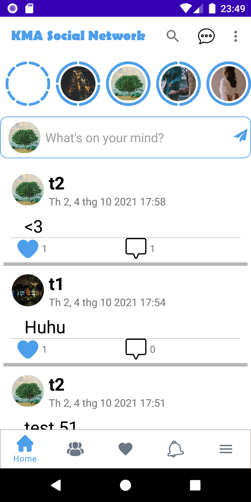
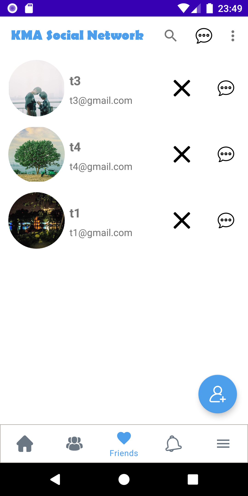
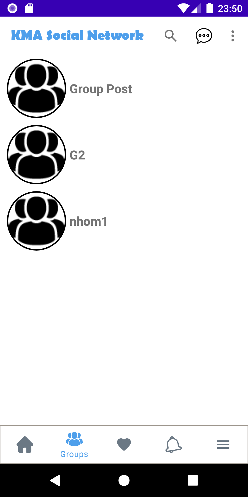
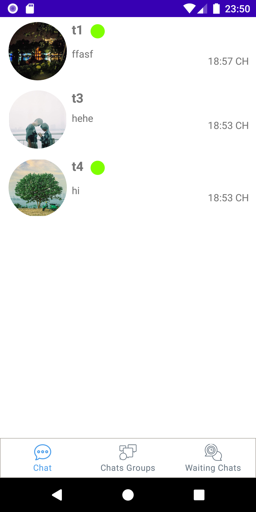
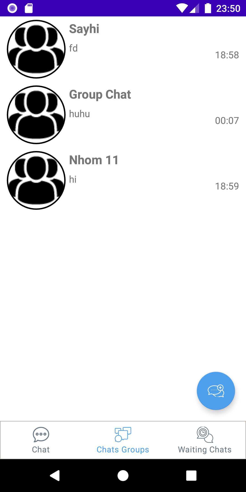
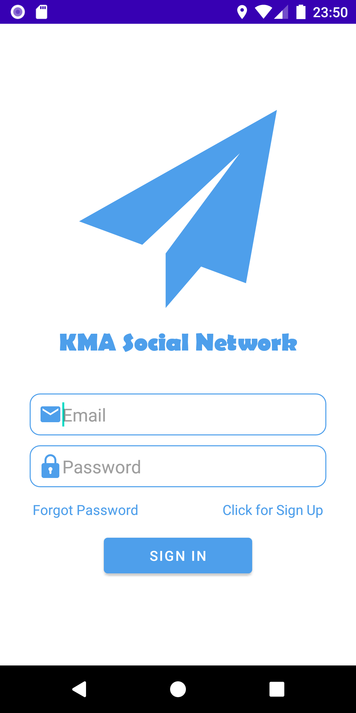

# KMASocialNetworkCt2
## Ứng dụng được tạo ra nhằm mục đích hướng đến các trường học. Nhằm giúp cho giáo viên và sinh viên có thể tương tác với nhau 1 cách chủ động.
## Ứng dụng mạng xã hội học tập sử dụng ngôn ngữ java và sử dụng Firebase để lưu trữ dữ liệu.
## Các hình ảnh mô tả ứng dụng

